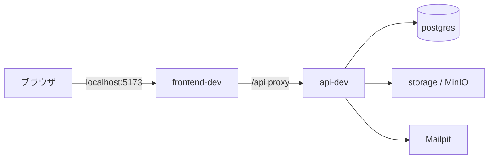
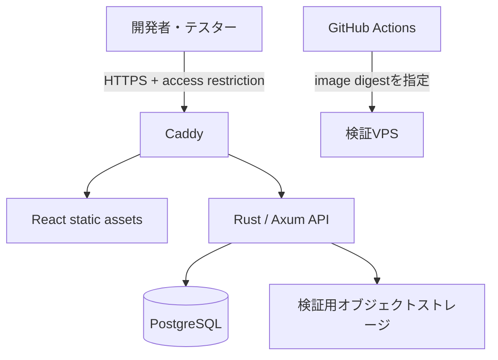

# 開発・検証環境設計

## 1. 環境方針

| 環境 | 目的 | 実行基盤 | データ |
|---|---|---|---|
| ローカル開発 | 実装、デバッグ、単体・統合テスト | 開発端末上のDocker Compose | 開発用の生成データ |
| CI | 静的検査、自動テスト、イメージ作成 | GitHub Actions | テストごとに初期化 |
| 検証 | 結合、E2E、受入、リリース確認 | 独立したConoHa VPS | 検証専用データ |
| 本番 | 顧客へのサービス提供 | ConoHa VPS | 顧客データ |

開発、検証、本番でアプリケーションコードとデータベーススキーマを共通化する。環境差分は、秘密情報、ドメイン、外部サービス接続先、ログレベル、リソース量などの設定に限定する。

## 2. ローカル開発環境

### 2.1 基本方針

開発者のホストOSに必要なソフトウェアは、Git、Docker EngineまたはDocker Desktop、Docker Composeのみとする。Node.js、pnpm、Rust、Cargo、PostgreSQLは開発コンテナ内で実行する。



| サービス | 役割 | 開発時の動作 |
|---|---|---|
| `frontend` | React、Vite、pnpm | ソースをマウントし、HMRを有効化する |
| `api` | Rust、Axum、Cargo | ソースをマウントし、変更時に自動再ビルドする |
| `postgres` | PostgreSQL | named volumeへデータを保存する |
| `migrate` | SQLx migration | 明示実行または初回起動時に一度だけ実行する |
| `mailpit` | 開発用SMTP・メール確認 | 外部へメールを送信せずWeb UIで確認する |
| `minio` | S3互換ストレージ | ファイル機能をローカルで検証する場合に使用する |
| `e2e` | Playwright | 必要時にprofile指定で起動する |

`mailpit`、`minio`、`e2e`はDocker Compose profilesで分離し、機能開発やテストで必要な場合だけ起動する。

### 2.2 Compose構成

以下のファイル構成を標準とする。

```text
compose.yaml                 # 全環境で共有するサービス定義
compose.dev.yaml             # bind mount、HMR、開発用ポート
compose.test.yaml            # テスト用DB、依存サービス
deploy/compose.staging.yaml  # 検証環境のリソース・公開設定
deploy/compose.prod.yaml     # 本番環境のリソース・公開設定
.env.example                 # 秘密を含まない設定例
```

ローカル起動の標準コマンドは次の形に統一する。

```bash
docker compose -f compose.yaml -f compose.dev.yaml up --build
```

補助操作は`Makefile`または同等のタスクランナーでラップし、開発者が内部コマンドを暗記しなくてよいようにする。

| コマンド | 動作 |
|---|---|
| `make dev` | 開発環境を起動する |
| `make down` | コンテナを停止する |
| `make reset` | 開発DBとストレージを破棄し、seedから再作成する |
| `make migrate` | DBマイグレーションを適用する |
| `make seed` | 再実行可能な開発データを投入する |
| `make test` | フロントエンドとバックエンドのテストを実行する |
| `make e2e` | PlaywrightのE2Eテストを実行する |
| `make lint` | TypeScriptとRustの静的検査を実行する |

### 2.3 コンテナ設計

- フロントエンドとAPIは開発専用Dockerfile stageを持つ。
- 依存関係キャッシュはnamed volumeを使用し、ホストへ`node_modules`やRustの`target`を作らない。
- ソースコードだけをbind mountし、コンテナイメージ内のツールチェーンを使用する。
- コンテナは原則として非rootユーザーで実行し、生成ファイルの所有者問題を防ぐ。
- ベースイメージと主要ツールのバージョンを固定する。
- ARM64とAMD64の両方で開発できるmulti-platform対応イメージを選ぶ。
- PostgreSQLのhealthcheck完了後にマイグレーションとAPIを起動する。
- アプリケーションの依存関係異常を検知するため、起動順だけに依存せずリトライとreadinessを実装する。

Rustの自動再ビルドには`cargo-watch`または同等ツールを開発stageだけに含める。Viteの開発サーバーはコンテナ内で`0.0.0.0`にbindし、APIへのアクセスはVite proxyを経由させる。これにより、ローカル開発では本番用CORS緩和を追加しない。

### 2.4 設定・秘密情報

- `.env.example`にはキー名と安全なダミー値だけを置く。
- `.env.local`などの実値ファイルはGit管理対象外とする。
- 開発用CookieはHTTP localhostで動作する設定とし、本番では必ず`Secure`を有効化する。
- 開発用パスワードや鍵を検証・本番環境へ流用しない。
- 外部サービスはsandbox、モック、Mailpit、MinIOを優先し、意図しない課金や外部送信を防ぐ。
- ログには開発環境でもパスワード、トークン、個人情報を出力しない。

### 2.5 開発データ

seedデータはコードで管理し、複数テナント、管理者、一般利用者、権限制限、空データ、大量データの代表ケースを再現できるようにする。実顧客の本番データを開発端末へ持ち込まない。

スキーマ変更は既存migrationの書換えではなく、新しいmigrationを追加する。CIでは空DBから全migrationを適用できることと、少なくとも直前リリース相当のDBから更新できることを確認する。

## 3. CI環境

Pull Requestごとに以下を実行する。

1. フロントエンドの依存関係固定確認、lint、型検査、単体テスト、ビルドを行う。
2. Rustの`fmt --check`、Clippy、単体テスト、依存関係監査を行う。
3. PostgreSQLコンテナへmigrationを適用し、API統合テストを行う。
4. テナント分離、認証、認可、RLSのセキュリティテストを行う。
5. Dockerイメージをビルドし、コンテナ起動とhealthcheckを確認する。
6. mainブランチではE2Eスモークテストとコンテナ脆弱性スキャンを追加実行する。

CIではローカルComposeと同じPostgreSQLメジャーバージョンを使用する。テストは順序に依存させず、実行ごとにDBを初期化する。

## 4. 検証環境

### 4.1 用途

検証環境は、開発者個人の動作確認環境ではなく、本番リリース候補を評価する共有環境とする。

- APIと画面の結合テスト
- PlaywrightによるE2Eテスト
- プロダクトオーナーによる受入テスト
- DBマイグレーションとロールバック手順の確認
- 外部サービスsandboxとの接続確認
- セキュリティ診断と軽量な性能試験
- 監視、アラート、バックアップ、復元手順の確認

負荷限界の測定や本番相当の性能保証は、検証VPSのサイズが本番と異なる場合には行わない。本番性能の受入試験は、本番同等スペックの一時環境を用意して実施する。

### 4.2 推奨構成

初期の検証環境は、ConoHa VPS Ver.3.0の4GB以上を1台使用する。本番とはサーバー、ネットワーク、DNS、ストレージ、秘密情報を分離する。



| 項目 | 構成 |
|---|---|
| OS・実行基盤 | 本番と同じUbuntu LTS、Docker Engine、Docker Compose |
| 配備物 | CIで作成・スキャン済みの本番用コンテナイメージ |
| ドメイン | `staging.example.com`等の本番と異なるドメイン |
| TLS | 本番と同じ方式で有効化 |
| アクセス | VPN、固定IP、または認証プロキシで制限 |
| DB | 検証専用PostgreSQL。インターネット非公開 |
| 外部連携 | sandboxまたは検証専用アカウント |
| メール | 検証用宛先のallowlistを適用し、顧客へ送信しない |
| ファイル | 検証専用bucketまたはnamespace |
| 監視 | 外形監視、リソース監視、ログ、アラートを本番同様に設定 |

検証環境ではソースコードをbind mountせず、Vite開発サーバーや`cargo-watch`を動かさない。本番と同じmulti-stage Dockerfileのruntime stageを使用する。

### 4.3 データ管理

- 本番DBをそのまま複製しない。
- 原則としてseedとテストシナリオで検証データを作成する。
- 本番由来データが不可欠な場合は、承認、項目削除・仮名化、アクセス期限、利用後削除を必須とする。
- 検証環境のテナント、ユーザー、APIキーを本番と共有しない。
- E2Eテストはテスト実行ごとに一意なテナントを作成し、終了後に削除する。
- 定期的にDBとオブジェクトストレージを初期化し、長期残存データを防ぐ。

### 4.4 デプロイ方式

mainブランチで作成したコンテナイメージを、commit SHAまたはdigestで検証環境へ自動配備する。検証承認後は同じdigestを本番へ昇格し、本番向けに再ビルドしない。

1. CIがテスト、ビルド、脆弱性スキャンを完了する。
2. migrationの前方互換性とバックアップ取得を確認する。
3. 検証環境へmigrationを適用する。
4. digestを固定してアプリケーションを更新する。
5. healthcheck、E2Eスモークテスト、監視通知を確認する。
6. 承認者がリリース候補の結果を記録する。
7. 同じdigestとmigrationを本番へ適用する。

検証デプロイ失敗時は直前のイメージへ戻す。DB変更は原則としてexpand-and-contract方式を用い、アプリケーションのロールバックを阻害する破壊的変更を同一リリースで行わない。

## 5. 環境差分

| 項目 | ローカル開発 | 検証 | 本番 |
|---|---|---|---|
| アプリ実行 | 開発stage、HMR | runtime stage | runtime stage |
| イメージ | ローカルbuild可 | CI作成digest | 検証済みと同じdigest |
| DB | Docker volume | 専用永続volume | 専用永続volume |
| データ | seedのみ | 生成・仮名化データ | 顧客データ |
| TLS | 原則不要 | 必須 | 必須 |
| Cookie Secure | 無効化可 | 必須 | 必須 |
| ログレベル | `debug`可 | `info` | `info` |
| 外部サービス | mock・sandbox | sandbox | production |
| メール | Mailpit | allowlist | 実送信 |
| アクセス制限 | localhost | 関係者のみ | 顧客向け公開 |
| バックアップ | 任意 | 日次 | RPOを満たす構成 |
| 監視 | 開発者確認 | 本番相当 | SLA対応 |

アプリケーションのfeature flagで環境固有のコード分岐を増やさない。外部接続先や機能の有効化は型付き設定として起動時に検証し、不足または矛盾した設定がある場合は起動を失敗させる。

## 6. リリース受入基準

- 開発環境がDocker Composeの単一コマンドで起動できる。
- 新規開発者がホストへNode.js、Rust、PostgreSQLを導入せず開発できる。
- 空DBからmigrationとseedを適用して主要画面を操作できる。
- ローカル、CI、検証でPostgreSQLのメジャーバージョンが一致する。
- 検証と本番が同じコンテナイメージdigestを使用できる。
- 検証環境から顧客へのメール送信や本番外部サービスの更新ができない。
- 本番データが開発・検証環境へ無承認で複製されない。
- 検証環境でmigration、スモークテスト、ロールバック手順を確認できる。
- 環境ごとの秘密情報とアクセス権限が分離されている。

