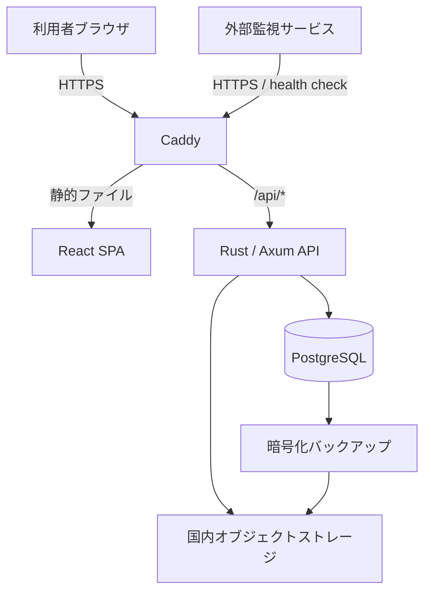
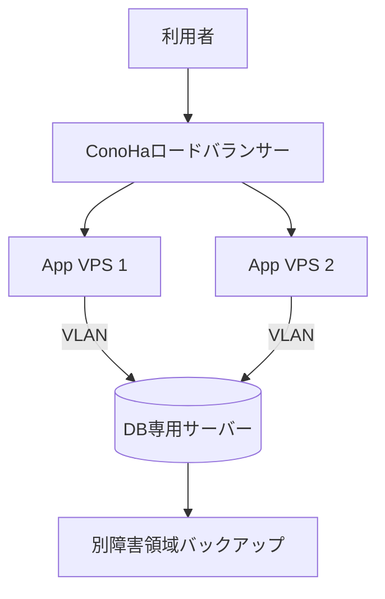

# SaaS技術スタック・初期インフラ構成

## 1. 方針

| 項目 | 決定 |
|---|---|
| フロントエンド | React + TypeScriptによるSPA |
| バックエンド | Rust + AxumによるREST API |
| データベース | PostgreSQL |
| ローカル開発環境 | Docker Composeによるコンテナ開発環境 |
| 検証環境 | 独立したConoHa VPS上のDocker Compose |
| 初期本番環境 | ConoHa VPS上のDocker Compose |
| アーキテクチャ | モジュラモノリス |
| テナント方式 | 共有DB・共有スキーマ、全業務テーブルに`tenant_id`を保持 |

初期段階では、開発速度と運用可能性を優先してサービスを細分化しない。アプリケーション内部は業務領域ごとにモジュールを分け、負荷や組織規模が拡大した時点でワーカー、ファイル処理、通知などを独立サービスへ分離できる構成にする。

開発環境と検証環境の詳細、環境差分、イメージ昇格手順は[開発・検証環境設計](environments.md)に定義する。

## 2. 採用技術

### 2.1 フロントエンド

| 分類 | 採用技術 | 用途・選定理由 |
|---|---|---|
| 言語 | TypeScript | API境界、フォーム、画面状態を型で検証する |
| UI | React | コンポーネントベースで業務画面を構築する |
| ビルド | Vite | SPAを静的ファイルとして生成し、本番Node.jsを不要にする |
| ルーティング | React Router | 認証済み画面、管理画面、エラー画面を構成する |
| サーバー状態 | TanStack Query | APIキャッシュ、再取得、ローディング、エラー処理を統一する |
| フォーム | React Hook Form + Zod | 入力制御とクライアント側検証を行う |
| UI部品 | MUI | 日本語業務SaaSに必要なフォーム、表、ダイアログを早期に揃える |
| APIクライアント | OpenAPIから自動生成 | Rust側のAPI仕様とTypeScript型の不一致を防ぐ |
| 単体テスト | Vitest + Testing Library | コンポーネントとフックを利用者視点で検証する |
| E2Eテスト | Playwright | ログイン、権限、主要業務フローをブラウザで検証する |
| パッケージ管理 | pnpm | lockfileをコミットし、CIとローカルの依存関係を固定する |

SSRが必要な一般公開サイトは、業務アプリとは別に静的サイトとして構築する。初期の業務アプリにはNext.jsを採用しない。Rust APIとは別にNode.jsサーバーを本番運用する必要が生じ、VPS上の障害点と保守対象が増えるためである。

### 2.2 バックエンド

| 分類 | 採用技術 | 用途・選定理由 |
|---|---|---|
| 言語 | Rust stable | `rust-toolchain.toml`でツールチェーンを固定する |
| Web | Axum | Tokio、Towerと統合し、認証、タイムアウト、トレースをミドルウェア化する |
| 非同期ランタイム | Tokio | HTTP、DB、外部APIなどの非同期I/Oを処理する |
| シリアライズ | Serde | JSONの入出力を型安全に処理する |
| DBアクセス | SQLx | PostgreSQLを非同期利用し、SQLとマイグレーションを明示管理する |
| API仕様 | OpenAPI 3.1 + utoipa | API仕様を生成し、フロントエンド型生成とAPI文書に使用する |
| エラー設計 | thiserror + anyhow | 業務エラーと起動・運用エラーを分離する |
| ログ | tracing + tracing-subscriber | JSON構造化ログ、リクエストID、テナントIDを記録する |
| 認証情報 | Argon2id | パスワードをソルト付き適応型ハッシュで保存する |
| ID | UUID v7 | 外部公開可能で、おおむね時系列に並ぶ識別子を使用する |
| 時刻 | UTC保存 | DBとAPIではUTC、画面表示時にJSTへ変換する |
| テスト | cargo test + testcontainers | PostgreSQLを用いた統合テストを実施する |
| 静的検査 | rustfmt + Clippy + cargo-audit | フォーマット、lint、既知脆弱性をCIで検査する |

APIは`/api/v1`配下に置く。成功レスポンスはリソースまたはページング情報を返し、エラーは少なくとも`code`、`message`、`request_id`を持つ共通形式にする。ブラウザへ内部エラー、SQL、スタックトレースを返さない。

### 2.3 データ・認証

| 分類 | 採用技術・方式 | 方針 |
|---|---|---|
| RDBMS | PostgreSQL | トランザクション、制約、監査性を優先する |
| マイグレーション | SQLx migrations | アプリ起動とは分離し、デプロイ工程で一度だけ適用する |
| テナント分離 | `tenant_id` + PostgreSQL RLS | API認可に加えてDB側でも別テナント参照を防ぐ |
| セッション | Secure、HttpOnly、SameSite Cookie | アクセストークンをブラウザのLocal Storageに保存しない |
| セッション保存 | PostgreSQL | 初期段階ではRedisを追加せず、失効可能なセッションをDB管理する |
| CSRF対策 | SameSite + CSRFトークン | 状態変更APIでトークンを検証する |
| 監査ログ | 追記専用テーブル | 操作者、テナント、対象、操作、結果、時刻、リクエストIDを保持する |
| ファイル | オブジェクトストレージ | VPSローカルディスクに顧客ファイルを永続保存しない |

RLSは補助防御であり、アプリケーションの認可を代替しない。各DBトランザクション開始時に認証済み`tenant_id`をDBセッションへ設定し、RLSポリシーとSQL条件の両方でテナントを制限する。接続プールへテナント情報が残らないことを統合テストする。

## 3. 初期本番構成

### 3.1 推奨構成

最初の本番はConoHa VPS Ver.3.0の12GB以上を推奨する。4GB構成は検証環境または利用者が限定されたパイロットに留める。PostgreSQL、コンテナ、監視を同居させる場合、メモリ不足がサービス全体の停止につながるためである。

| レイヤー | 構成 |
|---|---|
| OS | サポート期間内のUbuntu Server LTS |
| 実行基盤 | Docker Engine + Docker Compose |
| リバースプロキシ | Caddy。TLS終端、セキュリティヘッダー、静的配信、API転送を担当 |
| コンテナ | `proxy`、`api`、`postgres`、必要時のみ`worker` |
| 公開ポート | 80、443のみ。SSHは接続元制限し、鍵認証のみ許可 |
| 非公開ポート | API、PostgreSQL、メトリクスはDocker内部ネットワークだけで公開 |
| DNS | ConoHa DNSまたは同等サービス |
| ファイル・バックアップ | 本番VPSとは別障害領域の国内オブジェクトストレージ |
| 外形監視 | VPS外部から1分間隔で`/health/live`と主要画面を監視 |

`/health/live`はプロセスの生存だけを確認し、`/health/ready`はDB接続や必須依存先を確認する。後者はインターネットへ公開せず、デプロイと内部監視で使用する。

### 3.2 セキュリティ設定

- ConoHaのセキュリティグループとOSファイアウォールを併用する。
- SSHのパスワード認証とrootログインを無効化する。
- 管理者接続元を固定IPまたはVPNへ制限する。
- SaaS運営管理者とテナント管理者はTOTP MFAを必須とする。テナント管理者は初回ログイン時に設定し、1回限りのリカバリーコードを発行する。
- テナント管理者のTOTP秘密鍵は環境別の暗号鍵で暗号化してDBへ保存し、リカバリーコードはハッシュのみ保存する。
- MFA再設定ではパスワードと現在のTOTPまたはリカバリーコードを再確認し、既存セッションと旧リカバリーコードを失効する。
- テナント停止時は対象テナントの全セッションと未使用パスワード再設定トークンを失効する。
- サブスクリプション決済はStripe Billing、Stripe Checkout、Customer Portalを使用する。
- プランはアプリDBとStripe Product/Priceを対応付ける。Stripe Priceは変更せず、料金改定時は新しいPriceを作成する。
- 契約状態はブラウザからの申告ではなく、署名検証済みStripe Webhookを正として反映する。
- PostgreSQLをインターネットへ公開しない。
- OSとコンテナイメージへ定期的にセキュリティ更新を適用する。
- 秘密情報をGit、Dockerイメージ、Composeファイルへ埋め込まない。
- 秘密情報は権限を制限した環境ファイルとして配備し、ログへ出力しない。
- TLS 1.2以上、HSTS、CSP、`X-Content-Type-Options`等のヘッダーを設定する。

### 3.3 バックアップ・復旧

- PostgreSQLは継続的なWALアーカイブと日次ベースバックアップを取得する。
- バックアップを暗号化してVPS外の国内ストレージへ転送する。
- 目標RPOは1時間以内とし、WAL転送失敗を即時通知する。
- Compose定義、Caddy設定、復旧手順、DBマイグレーションをリポジトリで管理する。
- 月1回の自動復元テストと四半期ごとの手動復旧訓練を行う。
- VPSのイメージ保存はOS全体の復旧補助手段とし、DBバックアップの代替にしない。

## 4. デプロイ・監視

### 4.1 CI/CD

GitHub Actionsを標準とし、次の順序で実行する。

1. フロントエンドのlint、型検査、単体テスト、ビルドを行う。
2. Rustの`fmt --check`、Clippy、テスト、依存関係監査を行う。
3. PostgreSQLを起動してマイグレーションと統合テストを行う。
4. APIと静的ファイルを含むバージョン付きコンテナイメージを作成する。
5. 脆弱性スキャン後にコンテナレジストリへ保存する。
6. 本番でマイグレーションを適用し、イメージのdigestを固定して更新する。
7. readinessとスモークテスト成功後にリリースを確定する。

本番サーバー上でソースコードのビルドや`latest`タグの利用は行わない。直前のイメージdigestとDB互換性を保持し、アプリケーションをロールバック可能にする。

### 4.2 監視

| 対象 | 主要指標 |
|---|---|
| HTTP | 稼働率、p50/p95/p99応答時間、5xx率、リクエスト数 |
| Rust API | プロセス再起動、メモリ、CPU、DBプール待ち、外部API失敗 |
| PostgreSQL | 接続数、低速クエリ、ロック、容量、WAL、バックアップ成功時刻 |
| VPS | CPU、メモリ、ディスク使用率・I/O、ネットワーク |
| 業務 | ログイン失敗、メール送信失敗、ジョブ滞留、監査ログ書込み失敗 |

アプリケーションログはJSONで標準出力へ出し、ローテーションとVPS外への転送を行う。メトリクスはPrometheus形式で出力可能にするが、初期段階からVPS内に大規模な監視基盤を同居させない。可用性監視と通知は外部サービスを利用する。

## 5. 可用性に関する制約と移行

単一VPS構成は、非機能要件`AVL-03`の単一障害点排除を満たさない。ConoHa基盤のSLAと、アプリケーション全体のSLAは同一ではない。単一VPSを採用する期間は例外として記録し、稼働率99.9%を顧客へ保証しないか、停止時の契約上の扱いを明記する。

正式なSLA提供前に、次の構成へ移行する。

- アプリケーションVPSを2台以上にし、ロードバランサー配下へ置く。
- DBを専用サーバーへ分離し、アプリケーションとはVLANで接続する。
- セッションとファイルをアプリケーションVPSへ保持しない。
- DB障害時の復旧自動化または待機系を導入し、RTOを復旧試験で確認する。
- IaCはConoHa Terraform ProviderまたはAPIを利用し、VPS、ネットワーク、セキュリティ設定を再現可能にする。

## 6. 採用しない技術

| 技術 | 初期不採用の理由 | 再検討条件 |
|---|---|---|
| Kubernetes | 単一・少数VPSでは運用負荷が利益を上回る | 独立サービス数や配備頻度が増え、専任運用体制ができた場合 |
| マイクロサービス | 分散トランザクション、監視、デプロイが複雑になる | 組織または負荷の境界が明確になった場合 |
| Redis | セッションと軽量ジョブはPostgreSQLで開始できる | 高頻度キャッシュ、分散ロック、キュー負荷が必要になった場合 |
| GraphQL | 初期の業務APIではRESTとOpenAPIの方が単純 | 複数クライアントで取得項目の差が大きくなった場合 |
| Elasticsearch | PostgreSQL検索で初期要件を満たせる | 大規模全文検索や複雑な分析要件が確定した場合 |
| Next.js | 業務SPAにSSRを必要とせず、本番Node.jsが増える | SEO対象ページやSSR要件が業務アプリに生じた場合 |

## 7. バージョン管理方針

- React、Vite、Rust、Axumなどは採用時点の安定版を使用し、lockfileで固定する。
- Rustはstableを使用し、`rust-toolchain.toml`へ具体的なバージョンを記録する。
- PostgreSQLはサポート中のメジャーバージョンを使用し、メジャー更新を年次計画へ含める。
- UbuntuはLTSを採用し、標準サポート終了より前に更新する。
- 月1回の通常更新と、重大脆弱性に対する72時間以内の緊急更新を運用する。
- メジャーバージョン更新はステージング環境とバックアップ復元試験を通してから本番へ適用する。

## 8. 判断が必要な事業条件

実装開始前に、以下をプロダクト要件として確定する。

- 初年度のテナント数、登録利用者数、最大同時利用者数
- 顧客ファイルの有無、最大サイズ、保存期間
- メール、決済、外部IDプロバイダーなどの外部連携
- 管理者MFAの方式と、法人向けSSOの提供時期
- 単一VPS期間に顧客へ提示するSLAと免責条件
- 月額インフラ予算と、冗長構成へ移行する利用量・売上の閾値

## 9. 参考資料

- [React Versions](https://react.dev/versions)
- [Vite Getting Started](https://vite.dev/guide/)
- [Axum documentation](https://docs.rs/axum/latest/axum/)
- [SQLx documentation](https://docs.rs/sqlx/latest/sqlx/)
- [PostgreSQL Row Security Policies](https://www.postgresql.org/docs/current/ddl-rowsecurity.html)
- [Docker Engine on Ubuntu](https://docs.docker.com/engine/install/ubuntu/)
- [ConoHa VPS 料金・スペック](https://vps.conoha.jp/pricing/)
- [ConoHa VPS 機能一覧](https://vps.conoha.jp/function/)
- [ConoHa VPS Ver.3.0ドキュメント](https://doc.conoha.jp/products/vps-v3/)
